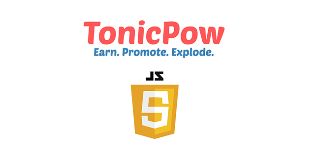

> **TonicPow JS** is the official JavaScript implementation for interacting with the [TonicPow API](https://docs.tonicpow.com)

[](https://github.com/tonicpow/tonicpow-js/commits/master)
[](https://github.com/tonicpow/tonicpow-js/releases)
[](https://www.npmjs.com/package/tonicpow-js)
[](https://github.com/tonicpow/widget/actions)
[](https://mergify.io)
[](https://atlantistic.slack.com/app_redirect?channel=tonicpow)

<br/>

## Table of Contents
- [Getting Started](#getting-started)
- [Installation](#install-via-npm)
- [Documentation](#documentation)
- [Examples](#examples)
- [Code Standards](#code-standards)
- [Usage](#usage)
- [Maintainers](#maintainers)
- [Contributing](#contributing)
- [License](#license)

<br/>

## Getting Started
This is a backend JavaScript library that has complete coverage for the [TonicPow API](https://docs.tonicpow.com).

There is also a [Go implementation](https://github.com/tonicpow/go-tonicpow) for this package.

#### Prerequisites
- You have a [TonicPow _api_key_](https://docs.tonicpow.com)
- You have a back-end server (IE: [Node](https://nodejs.org/en/), [Go](https://golang.org/), [Firebase Functions](https://firebase.google.com/docs/functions))

## Install via npm
From your project's directory:
```shell script
npm install tonicpow-js
``` 

And load the module in your project:
```javascript 
import TonicPow from 'tonicpow-js'

const tpow = new TonicPow('your-api-key')
``` 

#### Usage
Fire a conversion goal:
```javascript
const result = tpow.createConversionByGoalName(
  "goal_name", "tncpw_session_goes_here"
);
```

For more use cases, see the [examples](examples/examples.js) of using this package.

#### Features
- [Config & Session](lib/api.js) are completely configurable
- Supports both pure API token context and user token context (run your own site)
- Use our [front_end.js](front_end.md) for capturing a visitor session (goal conversions)
- Coverage for the [TonicPow.com API](https://docs.tonicpow.com/)
    - [x] [Authentication](https://docs.tonicpow.com/#632ed94a-3afd-4323-af91-bdf307a399d2)
    - [x] [Advertiser Profiles](https://docs.tonicpow.com/#2f9ec542-0f88-4671-b47c-d0ee390af5ea)
    - [x] [Campaigns](https://docs.tonicpow.com/#5aca2fc7-b3c8-445b-aa88-f62a681f8e0c)
    - [x] [Goals](https://docs.tonicpow.com/#316b77ab-4900-4f3d-96a7-e67c00af10ca)
    - [x] [Conversions](https://docs.tonicpow.com/#75c837d5-3336-4d87-a686-d80c6f8938b9)
    - [x] [Links](https://docs.tonicpow.com/#ee74c3ce-b4df-4d57-abf2-ccf3a80e4e1e)
    - [x] [Rates](https://docs.tonicpow.com/#fb00736e-61b9-4ec9-acaf-e3f9bb046c89)

<br/>

## Documentation
This is a JavaScript library for the [TonicPow API](https://docs.tonicpow.com). All methods and models are described in [this documentation](https://docs.tonicpow.com).

<details>
<summary><strong><code>Library Deployment</code></strong></summary>
<br/>

[goreleaser](https://github.com/goreleaser/goreleaser) for easy binary or library deployment to Github and can be installed via: `brew install goreleaser`.

The [.goreleaser.yml](.goreleaser.yml) file is used to configure [goreleaser](https://github.com/goreleaser/goreleaser).

Use `make release-snap` to create a snapshot version of the release, and finally `make release` to ship to production.
</details>

<details>
<summary><strong><code>Makefile Commands</code></strong></summary>
<br/>

View all `makefile` commands
```shell script
make help
```

List of all current commands:
```text
audit                Checks for vulnerabilities in dependencies
clean                Remove previous builds and any test cache data
help                 Show this help message
install              Installs the dependencies for the packge
lint                 Runs the standard-js lint tool
outdated             Checks for outdated packages via npm
publish              Will publish the version to npm
release              Full production release (creates release in Github, deploy to npm)
release-snap         Test the full release (build binaries)
release-test         Full production test release (everything except deploy)
replace-version      Replaces the version in HTML/JS (pre-deploy)
tag                  Generate a new tag and push (tag version=0.0.0)
tag-remove           Remove a tag if found (tag-remove version=0.0.0)
tag-update           Update an existing tag to current commit (tag-update version=0.0.0)
test                 Will run unit tests
```
</details>

<br/>

## Examples
View [examples](examples/examples.js) of using the package.

<br/>

## Code Standards
Always use the language's best practices!

<br/>

## Maintainers
| [](https://github.com/mrz1836) | [](https://github.com/rohenaz) |
|:------------------------------------------------------------------------------------------------:|:----------------------------------------------------------------------------------------------------:|
|                                [MrZ](https://github.com/mrz1836)                                 |                                [Satchmo](https://github.com/rohenaz)                                 |
                                                                                                                                                           
Support the development of this project and the [TonicPow](https://tonicpow.com/) team 🙏

<br/>

## Contributing
Feel free to dive in! [Open an issue](https://github.com/tonicpow/tonicpow-js/issues/new) or submit PRs.

### How can I help?
All kinds of contributions are welcome :raised_hands:!
The most basic way to show your support is to star :star2: the project, or to raise issues :speech_balloon:.
You can also support this project by [becoming a sponsor on GitHub](https://github.com/sponsors/tonicpow) :clap:
or by making a [**bitcoin donation**](https://tonicpow.com/?utm_source=github&utm_medium=sponsor-link&utm_campaign=tonicpow-js&utm_term=tonicpow-js&utm_content=tonicpow-js) to ensure this journey continues indefinitely! :rocket:

[](https://github.com/tonicpow/tonicpow-js/stargazers)


<br/>

## License
[](LICENSE)
